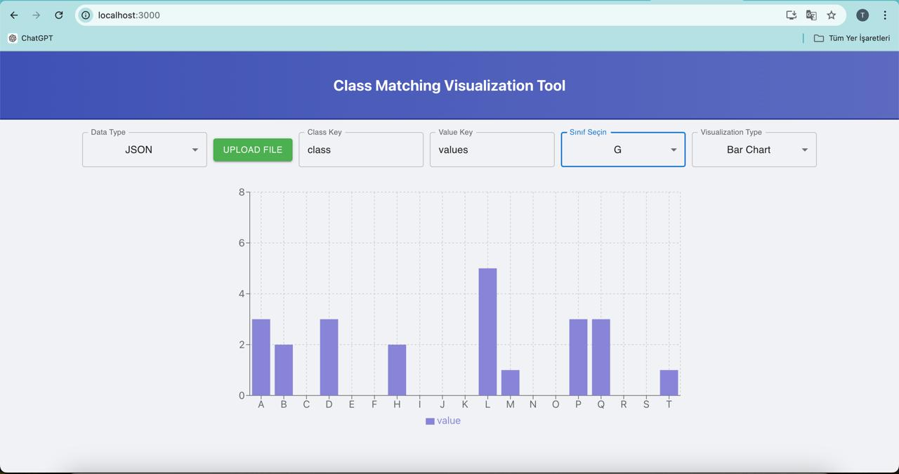

# Sınıf Eşleştirme Görselleştirme Aracı Belgelemesi

## Uygulamadan örnek bir resim




## Giriş

### Araç Genel Bakışı
Sınıf Eşleştirme Görselleştirme Aracı, kullanıcıların bir veri setindeki sınıflar arasındaki ilişkileri ve benzerlikleri analiz etmelerine ve görselleştirmelerine yardımcı olmak için tasarlanmış güçlü bir React tabanlı web uygulamasıdır. Bu araç, kullanıcıların JSON veya CSV formatında veri setleri yüklemelerini, verilerin nasıl yorumlanacağını belirtmelerini ve sınıf dağılımları ve ilişkileri hakkında içgörüler elde etmek için çubuk grafikler, pasta grafikler ve dağılım grafikleri gibi çeşitli görselleştirmeler oluşturmalarını sağlar.

### Ana Özellikler
- **Veri Yükleme:** JSON ve CSV formatlarını destekleyerek esnek veri girişi sağlar.
- **Özelleştirilebilir Anahtarlar:** Kullanıcılar, sınıf adlarını ve bunlara karşılık gelen değerleri temsil eden anahtarları tanımlayabilirler.
- **Birden Fazla Görselleştirme Türü:** Çubuk grafikler, pasta grafikler, dağılım grafikler ve daha fazlası dahil olmak üzere çeşitli grafiklerden seçim yapın.
- **Dinamik Arayüz:** Kullanıcı girdilerine ve yüklenen verilere göre arayüz gerçek zamanlı olarak güncellenir.

### Hedef Kitle
Bu araç şu kişiler için tasarlanmıştır:
- **Veri Bilimciler ve Analistler:** Sınıf tabanlı verileri hızlıca görselleştirerek desenleri, aykırı değerleri ve sınıf dengesizliklerini belirlemesi gereken kişiler.
- **Geliştiriciler:** Daha karmaşık veri görselleştirme araçları oluşturmak için özelleştirilebilir bir temel arayan kişiler.
- **Eğitmenler ve Öğrenciler:** Veri analiz tekniklerini keşfeden ve görsel veri temsillerini nasıl yorumlayacaklarını öğrenen kişiler.

## Kurulum ve Kurulum

### Gereksinimler
- **Node.js** (sürüm 14.x veya üstü)
- **npm** veya **yarn**

### Kurulum Adımları
1. **Depoyu klonlayın:**
   ```bash
   git clone https://github.com/Crocus-AI-Team/tool-for-class.git
   ```
2. **Proje dizinine gidin:**
   ```bash
   cd tool-for-class
   ```
3. **Bağımlılıkları yükleyin:**
   ```bash
   npm install
   # veya
   yarn install
   ```
4. **Geliştirme sunucusunu başlatın:**
   ```bash
   npm start
   # veya
   yarn start
   ```

### Uygulamayı Çalıştırma
Geliştirme sunucusu çalışırken tarayıcınızı açın ve `http://localhost:3000` adresine giderek aracı kullanmaya başlayın.

### Dizin Yapısı
- **src/**: Bileşenler, stiller ve varlıklar dahil olmak üzere tüm kaynak kodunu içerir.
- **public/**: Genel varlıklar ve HTML şablonu.
- **package.json**: Proje meta verileri, bağımlılıklar ve komutlar.

## Kullanım

### Kullanıcı Arayüzü Genel Bakışı
Arayüz, veri yükleme, anahtar yapılandırma ve görselleştirme seçimi için ayrılmış bölümlerle sezgisel ve kullanıcı dostu olacak şekilde tasarlanmıştır. Dinamik bir görüntüleme alanı, kullanıcının girdilerine dayalı olarak seçilen görselleştirmeyi gösterir.

### Veri Setlerini Yükleme
1. **Bir Dosya Yükleyin:**
   - "Dosya Yükle" düğmesine tıklayın.
   - Bilgisayarınızdan bir JSON veya CSV dosyası seçin.
2. **Desteklenen Veri Formatları:**
   - **JSON:** Sınıflar ve ilişkili değerler için anahtarlar içeren nesneler.
   - **CSV:** Sınıflar ve ilişkili değerleri temsil eden sütunlar.

### Görselleştirme Seçeneklerini Yapılandırma
- **Veri Türü:** Açılır menüden JSON veya CSV seçin.
- **Sınıf Anahtarı:** Veri setinde sınıf adlarını belirleyen anahtarı belirtin.
- **Değer Anahtarı:** Her sınıfla ilişkili değerleri belirleyen anahtarı belirtin.

## Veri Seti Yapı Gereksinimleri

Bu kılavuz, Sınıf Eşleştirme Görselleştirme Aracı ile kullanılacak veri setleri için gerekli yapıyı sağlar. Araç, hem JSON hem de CSV formatlarını destekler ve sınıf adlarını ve bunlara karşılık gelen değerleri tanımlamak için belirli anahtarlara ihtiyaç duyar.

### JSON Formatı

Bir JSON dosyası kullanırken, her girişin en az iki anahtarı olan bir nesne olması gerekir: biri sınıf için, diğeri ise değerler için.

#### Örnek JSON Yapısı

```json
[
  {
    "class": "A",
    "values": [1, 2, 3, 4, 5]
  },
  {
    "class": "B",
    "values": [2, 3, 4, 5, 6]
  },
  {
    "class": "C",
    "values": [3, 4, 5, 6, 7]
  }
]
```

#### JSON Anahtar Gereksinimleri

- **Sınıf Anahtarı:** Bu anahtar, "A" veya "B" gibi sınıf adını içermelidir.
- **Değer Anahtarı:** Bu anahtar, sınıfla ilişkili değerlerin bir dizisini içermelidir (örneğin, `[1, 2, 3, 4, 5]`).

### CSV Formatı

Bir CSV dosyası kullanırken, yapı sınıf için bir sütun ve değerler için bir sütun içermelidir. Değerler, tek bir hücre içinde virgülle ayrılmış bir liste olmalıdır.

#### Örnek CSV Yapısı

```csv
class,values
A,"1,2,3,4,5"
B,"2,3,4,5,6"
C,"3,4,5,6,7"
```

#### CSV Sütun Gereksinimleri

- **Sınıf Sütunu:** Bu sütun, sınıf adlarının bir listesini içermelidir (örneğin, A, B, C).
- **Değerler Sütunu:** Bu sütun, virgülle ayrılmış bir değerler dizisini içermelidir.

### Sınıf ve Değer Anahtarlarını Seçme
Bu araç, veri setinizde sınıf adlarını ve bunlara karşılık gelen değerleri temsil eden anahtarları seçme esnekliği sağlar. Sağlanan alanlara anahtarları girin ve araç, seçiminizi yansıtacak şekilde otomatik olarak güncellenecektir.

### Görselleştirmeleri Görüntüleme ve Yorumlama
Veri setini yapılandırdıktan sonra:
1. **Bir Sınıf Seçin:** Görselleştirmeyi bu sınıfa odaklamak için açılır menüden bir sınıf seçin.
2. **Bir Görselleştirme Türü Seçin:** Çubuk Grafik, Pasta Grafik, Dağılım Grafiği vb. seçeneklerden birini seçin.
3. **Görselleştirmeyi Yorumlayın:** Görsel çıktıyı analiz ederek sınıf benzerliklerini, dağılımlarını ve potansiyel dengesizlikleri anlayın.

### Bu Araç Dengesiz Sınıf Görselleştirmesine Nasıl Yardımcı Olur?
Veri setlerindeki dengesiz sınıflar, düzgün bir şekilde ele alınmazsa yanlı modeller ve yanıltıcı içgörüler oluşturabilir. Bu araç, kullanıcıların sınıf dengesizliklerini tanımlamalarına ve anlamalarına yardımcı olmak için çeşitli özellikler sunar:

- **Görsel Karşılaştırma:** Çubuk grafikler, pasta grafikler ve dağılım grafikler aracılığıyla sınıf dağılımlarını görselleştirerek, hangi sınıfların yetersiz temsil edildiğini veya aşırı temsil edildiğini hızlıca görebilirsiniz.
- **Benzerlik Analizi:** Araç, sınıflar arasındaki benzerlik derecesini hesaplar ve görselleştirir, bu da belirli sınıfların diğerleriyle daha fazla özellik paylaşıp paylaşmadığını, dolayısıyla dengesizlikleri maskeleyip maskelemediğini vurgulayabilir.
- **Dinamik Keşif:** Kullanıcılar, farklı sınıfların birbirleriyle nasıl karşılaştırıldığını etkileşimli olarak keşfederek, sınıf dengesizliklerinin veri analizi ve modelleme çabalarını nasıl etkileyebileceğini daha iyi anlayabilir.

Bu içgörüleri sağlayarak araç, kullanıcıların sınıf dengesizliklerini ele almak için veri artırma, yeniden örnekleme teknikleri veya adil ve doğru sonuçlar sağlamak için modelleme stratejilerini ayarlama gibi proaktif adımlar atmalarına yardımcı olur.

##

 Özelleştirme

### Kullanıcı Arayüzünü Değiştirme
UI'yı özelleştirmek için:
- **Stiller:** `App.css` içindeki stilleri güncelleyin veya bireysel bileşen stillerini değiştirin.
- **Düzen:** `App.js` veya ilgili bileşen dosyalarındaki bileşen düzenini ihtiyacınıza göre ayarlayın.

### Yeni Görselleştirme Türleri Ekleme
1. **Yeni Bir Bileşen Oluşturun:**
   - `components` dizininde yeni bir dosya ekleyin (örneğin, `CustomChartComponent.js`).
2. **Bileşeni `App.js` İçine Dahil Edin:**
   - Yeni bileşeni içe aktarın ve entegre edin.
3. **UI'yı Güncelleyin:**
   - Arayüzdeki açılır menüye yeni görselleştirme türünü ekleyin.

### Varsayılan Ayarları Değiştirme
`App.js` içindeki başlangıç değerlerini değiştirin:
- **Varsayılan Sınıf Anahtarı:** `classKey` durumunu güncelleyin.
- **Varsayılan Değer Anahtarı:** `valueKey` durumunu güncelleyin.

### Veri ve Görselleştirme Mantığını Yönetme
- **Veri İşleme:** Ana veri işleme fonksiyonları (örneğin, `processData`, `updateChartData`) `App.js` içinde bulunur. Bu fonksiyonları özelleştirerek verilerin nasıl yorumlanacağını ve görselleştirileceğini değiştirebilirsiniz.

## Geliştirme ve Katkı

### Geliştirme Ortamı Kurulumu
Yerel bir geliştirme ortamı kurmak için:
1. Kurulum adımlarını izleyin.
2. Node.js ve npm/yarn'ın uyumlu sürümlerine sahip olduğunuzdan emin olun.

### Kod Yapısı ve Anahtar Bileşenler
- **App.js:** Ana uygulama mantığını ve durumunu yönetir.
- **components/**: Grafikler, seçiciler ve yükleyiciler gibi yeniden kullanılabilir UI bileşenlerini içerir.
- **styles/**: Uygulamada kullanılan tüm CSS dosyalarını içerir.

### İşlevselliği Genişletme
- **Yeni Özellikler Ekleyin:** Yeni bileşenler oluşturun veya ek özellikler tanıtmak için mevcut olanları değiştirin.
- **Hataları Düzeltin:** İlgili kodu `App.js` veya etkilenen bileşende güncelleyerek sorunları çözün.

### Sorun ve Çekme Talepleri Gönderme
- **Sorun Bildirin:** GitHub'daki depo Issues sekmesini kullanarak hataları bildirin veya yeni özellikler isteyin.
- **Katkıda Bulunun:** Çekme taleplerini gönderirken kod kalitesini ve tutarlılığını sağlamak için en iyi uygulamaları takip edin.

### Kodlama Standartları ve En İyi Uygulamalar
- **ESLint:** Tutarlı kod formatlaması için ESLint kurallarına uyun.
- **Belgeler:** Okunabilirliği ve sürdürülebilirliği artırmak için gerekli yerlerde kodunuzu yorumlayın.

## API Belgelemesi

### Kullanılan API'lerin Genel Bakışı
Uygulanabilirse, bu bölüm aracın etkileşimde bulunduğu API'leri tanımlar. Bu özel araç için, harici API'ler gerekli değildir.

## Sorun Giderme

### Yaygın Sorunlar ve Çözümler
- **Dosya Yükleme Hataları:** Dosyanın doğru formatlandığından ve doğru uzantıya sahip olduğundan emin olun (.json veya .csv).
- **Görselleştirme Güncellenmiyor:** Sınıf ve değer anahtarlarının doğru ayarlandığını ve veri seti yapısıyla eşleştiğini kontrol edin.

### Konsol Hatalarını ve Uyarılarını Anlama
- **React Uyarıları:** Kullanım dışı bırakılmış özellikler veya önerilen uygulamalarla ilgili uyarılarla karşılaşabilirsiniz. Bu uyarıları konsolda verilen talimatları izleyerek veya ilgili kodu güncelleyerek giderin.

### Hata Ayıklama İpuçları
- **Chrome DevTools:** Öğeleri incelemek, kodu hata ayıklamak ve ağ etkinliğini izlemek için DevTools'u kullanın.
- **Günlük Kaydı:** Veri akışını izlemek ve durum değişikliklerini izlemek için `App.js` içine `console.log` ifadeleri ekleyin.

## SSS

### Sıkça Sorulan Sorular
1. **Hangi dosya formatları destekleniyor?**
   - JSON ve CSV.
2. **Kendi görselleştirmelerimi ekleyebilir miyim?**
   - Evet, Özelleştirme bölümündeki kılavuzu takip ederek aracı genişletebilirsiniz.

## Lisans

Bu proje MIT Lisansı altında lisanslanmıştır. Daha fazla ayrıntı için depoda bulunan LICENSE dosyasına bakın.

## Değişiklik Günlüğü

### Sürüm 1.0.0
- **İlk Yayın:**
  - JSON ve CSV veri yüklemelerini destekler.
  - Çubuk Grafik, Pasta Grafik ve daha fazlası dahil olmak üzere birden fazla görselleştirme türü.
  - Etkileşimli ve dinamik kullanıcı arayüzü.